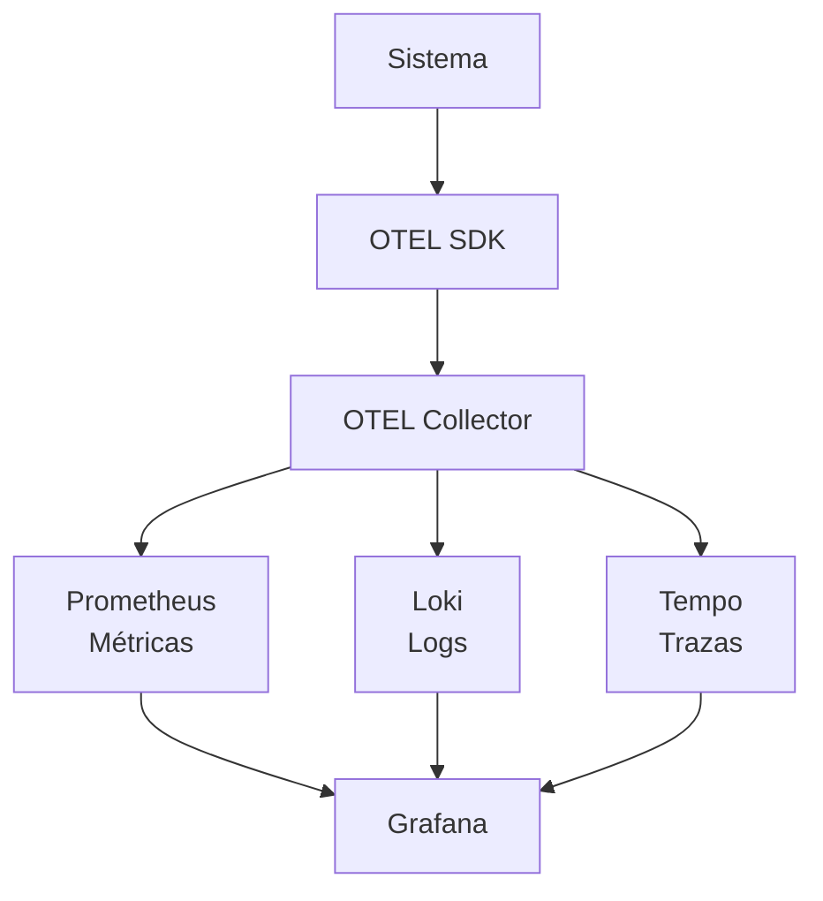

## Diferencia entre monitoreo y observabilidad

El monitoreo se centra en la revisión del estado del sistema, haciendo uso de metricas que ya están definidas. El objetivo del monitoreo es detectar si algo anda mal, en la mayoria de casos, compara valores obtenidos con umbrales y por último nos avisa qué es lo que está fallando.

Por otro lado, la observabilidad va a buscar entender el por qué de dichos comportamientos. Acá no solo se va a recolectar datos, sino también se va a integrar métrcias o trazas para obtener una vista profunda del sistema. Sería un forma más rápida para el análisis de sistemas.

## Tipos de telemetría

**1.** Métricas (Prometheus/OTEL)

Estos son valores númericos que describen el estado del sistema durante el tiempo, valores como latencias, solicitudes, etc. Estas métrcias son importantes para el sistema de alertas si algo anda fuera de lo normal.

**2.** Logs (Loki)

Estos son mensajes que van a representar o indicar ciertos eventos en el sistema como: peticiones, errores, información en general. Para este caso, la aplicación envía logs con OTEL, se reenvían y loki se encarga del almacenamiento.

**3.** Trazas distribuidas (Tempo)

Las trazas nos permiten seguir recorrridos de una petición a través de diversos servicios. En este caso, con Tempo, se puede ver como una solicitud pasa por la aplicación y también dónde se generan los cuellos de botella o simplemente fallos.

## Diagrama

